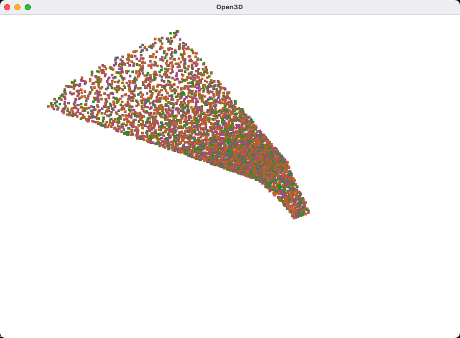
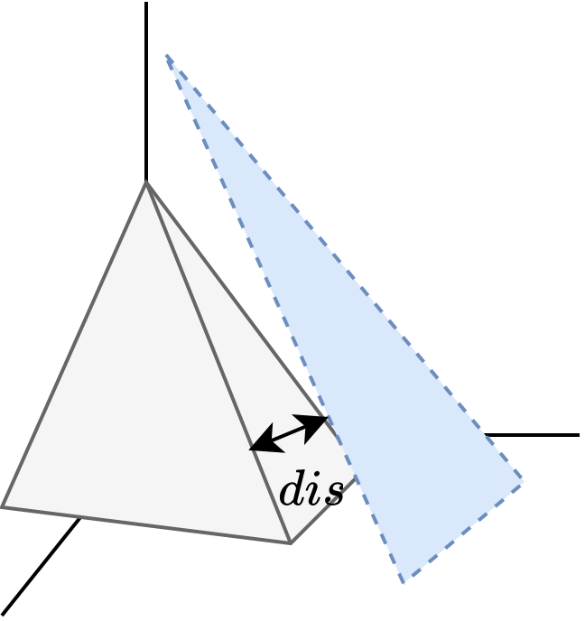
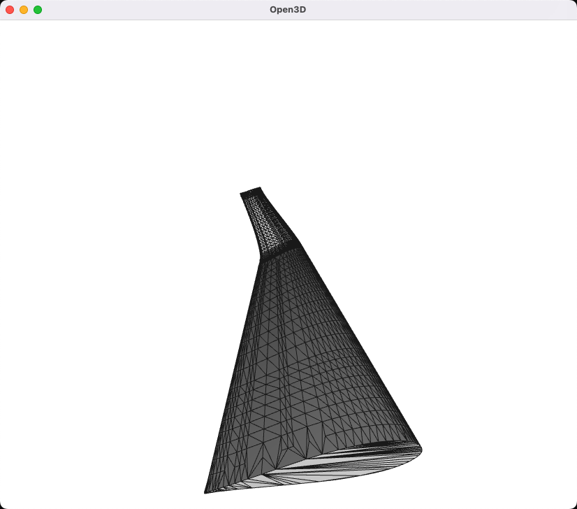
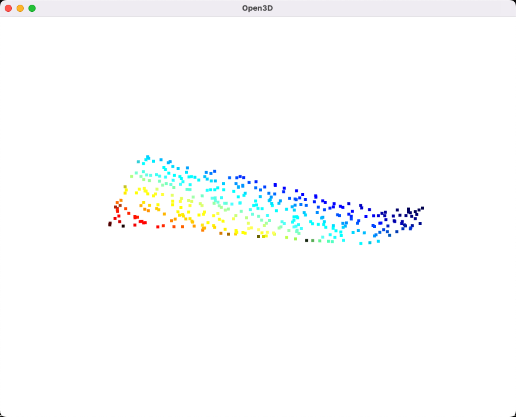
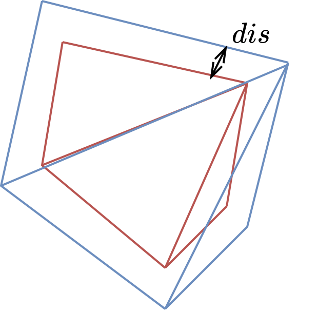
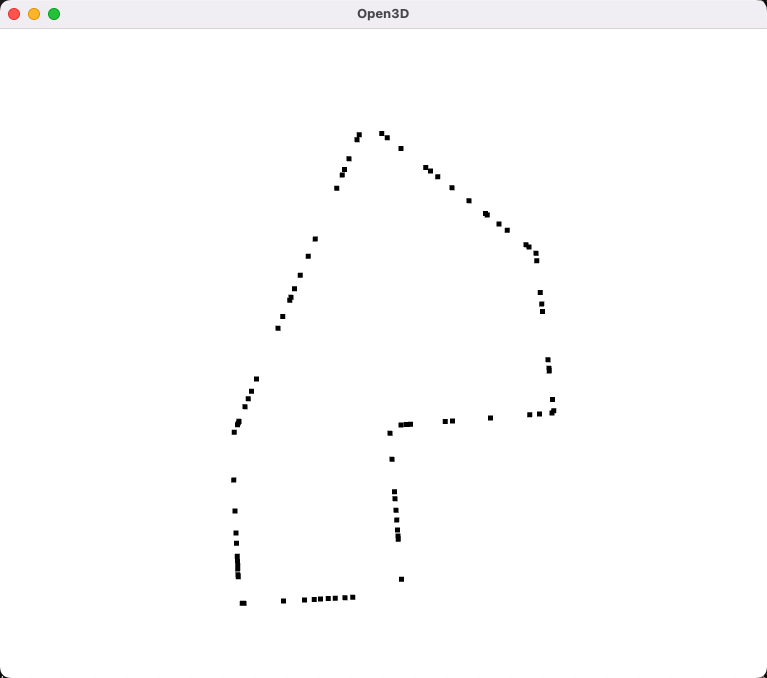

[TOC]

# Inflation

该函数库主要实现了读入STL 几何图形，并通过外法向量进行外扩的功能。

## inflation_sample

该函数为主要函数，实现了读入STL 几何图形，并通过外法向量进行外扩的功能。

```python
def inflation_sample(
    mesh,
    dis=(float, list, np.ndarray),
    density=(float, list, np.ndarray),
    dim=3,
    mode="uniform",
    seed=-1,
):
    """
    Inflation the mesh and sample points from the inflated mesh

    Parameters
    ----------
    mesh : open3d.geometry.TriangleMesh

    dis : float or list or np.ndarray
        The distance to inflate

    density : float or list or np.ndarray
        The density of points to be sampled

    dim : int
        The dimension of the mesh, can be 2 or 3

    mode : str
        The mode of sampling, can be "uniform" or "poisson_disk" for 3D mesh, and "uniform" or "grid" for 2D mesh

    seed : int
        The seed of random number generator

    Returns
    -------
    open3d.geometry.PointCloud
    """
```

该函数输入一个三角网格，以及外扩距离序列，采样密度序列，输出一个采样点云。

外扩距离与采样密度序列可以是单个数值，也可以是序列，如果是序列，则会对序列中的每个数值进行外扩与采样，最后将所有采样点合并，输出每一层的采样点云列表。以下是序列例子：

```python
dis = [1, 2] # 第一层外扩1，第二层外扩2
density = [0.1, 0.1] # 第一层采样密度为0.1，第二层采样密度为0.1

dis = np.arange(1, 5, 0.2) # 外扩1 ~ 5距离，每层间隔为0.2
density =  np.linspace(10, 5, 4) # 采样密度从10 ~ 5，每层衰弱
```

> 注意保持dis与density序列长度一致

### Example

```python
import open3d as o3d
import inflation as inf
import numpy as np

mesh = o3d.io.read_triangle_mesh("./example/wing.stl")

pcs = inf.inflation_sample(
    mesh,
    dis=np.linspace(0.1, 0.5, 4),
    density=np.linspace(50, 10, 4),
    mode="uniform",
    seed=0,
)

o3d.visualization.draw_geometries(pcs)
```



## inflation

```python
def inflation(mesh, dis):
    """
    Inflation the mesh

    Parameters
    ----------
    mesh : open3d.geometry.TriangleMesh
        The mesh to be inflated
    dis : float
        The distance to inflate

    Returns
    -------
    open3d.geometry.TriangleMesh
        The inflated mesh
    """
```

该函数输入一个三角网格，输出一个与原三角面外扩 `dis` 距离的三角网格。如下图所示：


### Example

```python
import open3d as o3d
from inflation import inflation

mesh = o3d.io.read_triangle_mesh("./example/wing.stl")
mesh.compute_vertex_normals()
mesh.paint_uniform_color([0.5, 0.5, 0.5])
o3d.visualization.draw_geometries([mesh], mesh_show_wireframe=True)

mesh_inflated = inflation(mesh, 0.01)
mesh_inflated.compute_vertex_normals()
o3d.visualization.draw_geometries([mesh_inflated], mesh_show_wireframe=True)
```



---

## sample_points

```python
def sample_points(mesh, density=1, mode="uniform", seed=-1):
    """
    Sample points from the mesh

    Parameters
    ----------

    mesh : open3d.geometry.TriangleMesh
        The mesh to be sampled

    density : int
        The density of points to be sampled

    mode : str
        The mode of sampling, can be "uniform" or "poisson_disk"

    seed : int
        The seed of random number generator

    Returns
    -------
    open3d.geometry.PointCloud
    """
```

该函数输入一个三角网格，以及采样密度，输出一个采样点云。

**密度其含义为单位面积采样点数目**，最终采样点的数目为 density * mesh_area，即密度乘以三角面表面积。

### Example

```python
import open3d as o3d
from inflation import sample_points

mesh = o3d.io.read_triangle_mesh("./example/wing.stl")

points = sample_points(mesh, 10, "uniform")
o3d.visualization.draw_geometries([points])

points = sample_points(mesh, 10, "poisson_disk")
o3d.visualization.draw_geometries([points])
```



---

## offset

```python
def offset(mesh, dis):
    """
    Offset the 2D mesh

    Parameters
    ----------
    mesh : open3d.geometry.TriangleMesh
        The mesh to be offset

    dis : float
        The distance to offset

    Returns
    -------
    open3d.geometry.TriangleMesh
    """
```

该函数输入一个二维三角网格，输出一个与原三角面边缘外扩 `dis` 距离的三角网格，如下图所示。



### Example

```python
import open3d as o3d
from inflation import offset

mesh = o3d.io.read_triangle_mesh("./example/2d.stl")
mesh.compute_vertex_normals()
mesh.paint_uniform_color([0.5, 0.5, 0.5])
o3d.visualization.draw_geometries([mesh], mesh_show_wireframe=True)

mesh_inflated = offset(mesh, 0.01)
o3d.visualization.draw_geometries([mesh_inflated], mesh_show_wireframe=True)
```

---

## edge_sample

```python
def edge_sample(mesh, density=1, mode="uniform", seed=-1):
    """
    Sample points from the 2D mesh edges

    Parameters
    ----------
    mehs : open3d.geometry.TriangleMesh
        The mesh to be sampled

    density : int
        The density of points to be sampled

    mode : str
        The mode of sampling, can be "uniform" or "grid"

    seed : int
        The seed of random number generator
    """
```

对二维的几何体的边缘进行采样，输出采样点云。

density 定义为单位距离采样点数目，最终采样点的数目为 density * mesh_edge_length，即密度乘以边长。

### Example

```python
import open3d as o3d
from inflation import edge_sample

mesh = o3d.io.read_triangle_mesh("./example/2d.stl")

points = edge_sample(mesh, 10, "uniform")
o3d.visualization.draw_geometries([points])
```



# 注意⚠️

inflation 不应该外扩过多距离，否则对于网格中的部分凹面，会导致外扩后的凹面变成凸面（翻转），从而导致采样点云中出现异常点。
